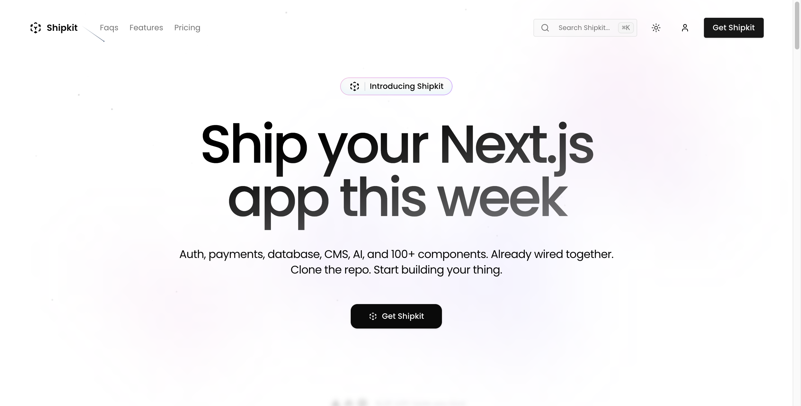
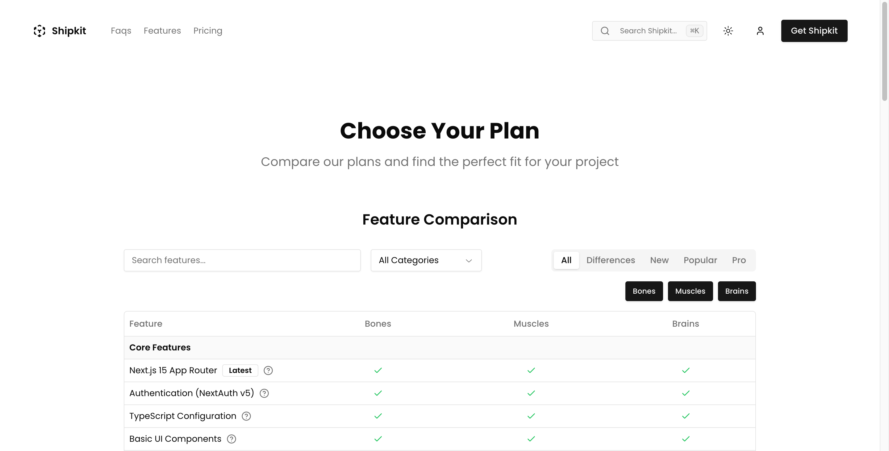
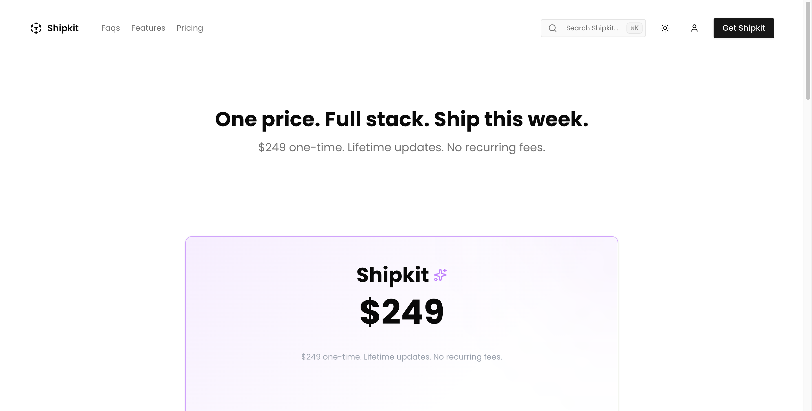
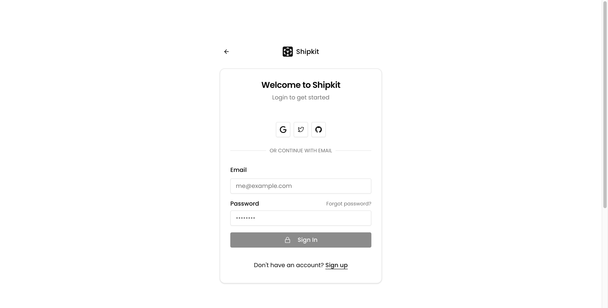
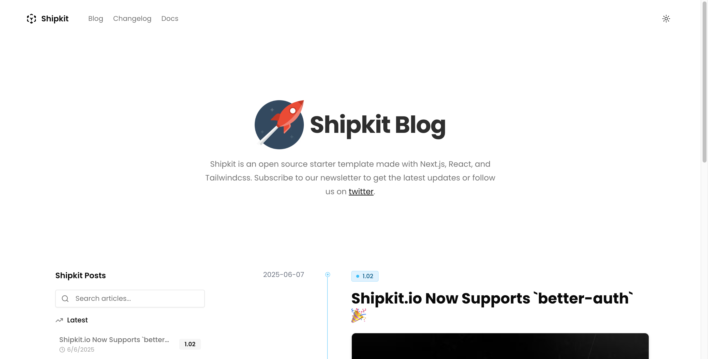

# Shipkit 🚀

Launch your app at light speed. Fast, flexible, and feature-packed for the modern web.

Made with ❤️ by [Lacy](https://lacy.sh)

[](https://shipkit.io)

## Deploy in 30 Seconds

[](https://vercel.com/new/clone?repository-url=https%3A%2F%2Fgithub.com%2Fshipkit-io%2Fshipkit&project-name=shipkit-app&repository-name=shipkit-app&redirect-url=https%3A%2F%2Fshipkit.io%2Fx%2Fvercel%2Fdeploy&developer-id=oac_KkY2TcPxIWTDtL46WGqwZ4BF&production-deploy-hook=Shipkit%20Deploy&demo-title=Shipkit%20Preview&demo-description=The%20official%20Shipkit%20Preview.%20A%20full%20featured%20demo%20with%20dashboards%2C%20AI%20tools%2C%20and%20integrations%20with%20Docs%2C%20Payload%2C%20and%20Builder.io&demo-url=https%3A%2F%2Fshipkit.io%2Fdemo&demo-image=%2F%2Fshipkit.io%2Fimages%2Fdemo.png)

[](https://pr.new/lacymorrow/shipkit)

No environment variables needed to start! The setup wizard guides you through configuration after deployment.

## Screenshots

<table>
  <tr>
    <td><a href="https://shipkit.io/features"></a></td>
    <td><a href="https://shipkit.io/pricing"></a></td>
  </tr>
  <tr>
    <td><a href="https://shipkit.io/sign-in"></a></td>
    <td><a href="https://shipkit.io/blog"></a></td>
  </tr>
</table>

## What's Included

- 🔐 **Authentication** - Auth.js, Better Auth, Clerk, Supabase, Stack ([details](docs/features/authentication.mdx))
- 💳 **Payments** - Lemon Squeezy, Stripe, Polar ([details](docs/features/payments.mdx))
- 📝 **CMS** - Payload CMS v3 ([details](docs/features/cms.mdx))
- 🎨 **Visual Editor** - Builder.io ([details](docs/features/visual-builder.mdx))
- 📧 **Email** - Resend + magic links ([details](docs/features/email.mdx))
- 🤖 **AI** - Browser-based SmolLM + OpenAI/Anthropic ([details](docs/features/ai.mdx))
- 🎯 **Analytics** - PostHog, Umami, Google, Statsig ([details](docs/features/analytics.mdx))
- 💾 **Database** - PostgreSQL + Drizzle ORM ([details](docs/features/database.mdx))
- 📦 **Storage** - AWS S3, Vercel Blob ([details](docs/features/storage.mdx))
- 🚀 **Performance** - Edge-optimized with caching ([details](docs/guides/caching.mdx))

## Stack

- ⚡️ [Next.js 16](https://nextjs.org) - App Router
- 🎨 [Tailwind CSS](https://tailwindcss.com) + [Shadcn/UI](https://ui.shadcn.com)
- 🛠 [Drizzle ORM](https://orm.drizzle.team) - Type-safe database
- 📝 [Payload CMS v3](https://payloadcms.com) - Content management
- 🎨 [Builder.io](https://builder.io) - Visual editing
- 📧 [Resend](https://resend.com) - Email

## Quick Start

```bash
git clone https://github.com/shipkit-io/shipkit
cd shipkit
bun install --frozen-lockfile
bun dev
```

## Documentation

- 📚 [Full Documentation](docs/index.mdx)
- 🚀 [Deploy Guide](docs/getting-started/deploy.mdx)
- 🔧 [Development Guide](docs/development/index.mdx)
- 🤖 [AI Assistant Guide](CLAUDE.md)

## Support

[](https://github.com/sponsors/lacymorrow)

ShipKit is built and maintained full-time. Your sponsorship directly funds new features and faster releases.

- 💬 [GitHub Discussions](https://github.com/shipkit-io/shipkit/discussions)
- 🐦 [Follow Updates](https://twitter.com/lacybuilds)
- 📧 [Contact](https://shipkit.io/contact)
- 🌐 [Website](https://shipkit.io)

## Found a bug?

[GitHub Issues](https://github.com/shipkit-io/shipkit/issues)

## License

MIT - see [LICENSE](LICENSE)
